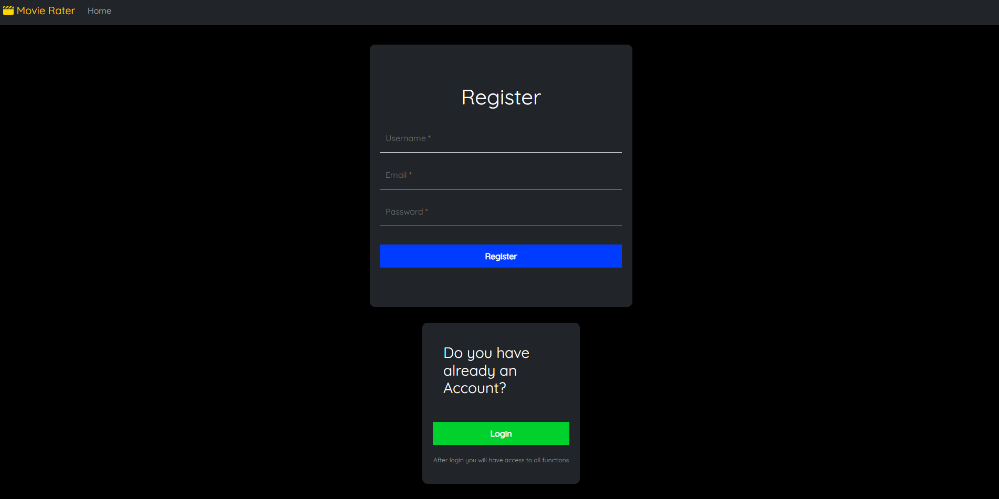
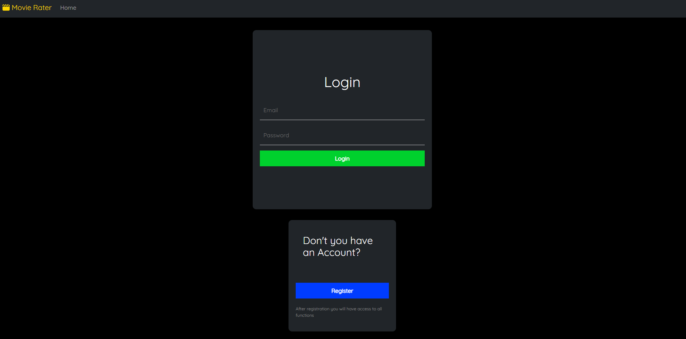
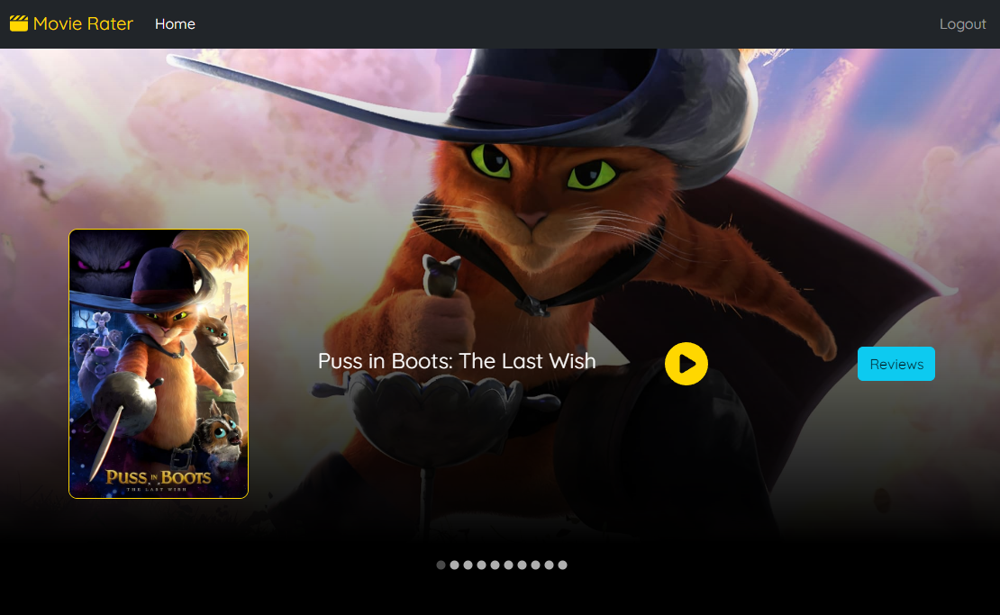
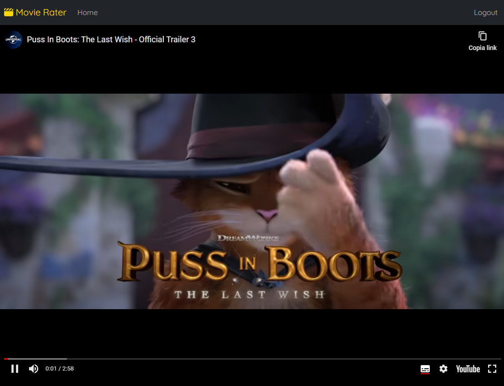
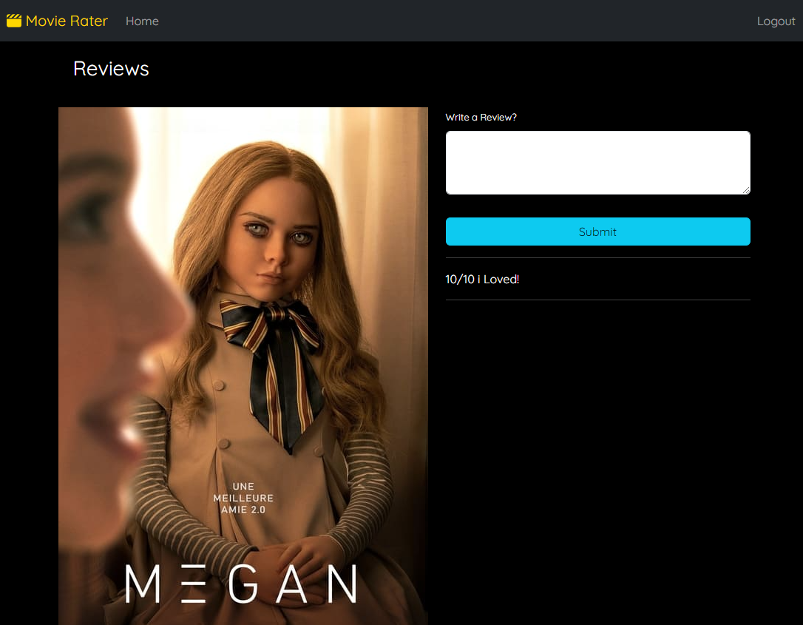

<meta name="title" content="Movie Rater">
<meta name="description" content="Movie Rater is a web application that allows people to watch movie trailers and leave a review on the movie they just watched, and also login and register feature.">
<meta name="keyword" content="Movie Rater, MovieRater, Springboot, Java, Springboot App, MovieRater Github, Github, R3ddy95, R3ddy95 Github, React">

# Movie Rater 🎬​
Movie Rater is a complete web application with both FrontEnd and BackEnd, that allows people to watch movie trailers and leave a review on the movie they just watched, and also login and register feature.

The project was created with:

* Front-end: React, Router-dom, Boostrap, Material-UI
* Backend: Java, SpringBoot
* Database: MongoDB
* Deployment: Render, Firebase

You can Try it [Here]([https://movierater-3b15c.web.app/)

## How it works
The user can start by registering on the website



After registering you will be redirected to the login page



Once logged in you will be redirected to the home page



Where you can watch the films and watch the trailer



Or click on the review button to leave a review of the film with a comment



And at the end you can log out at the top right of the header.

## Languages
* HTML5
* CSS3
* Javascript ES6
* JSX
* Java

## What i used
* [React](https://react.dev/)
* [Node.js](https://nodejs.org/it)
* [React-Router](https://reactrouter.com/en/main)
* [Axios](https://axios-http.com/) for the API requests
* [Bootstrap](https://getbootstrap.com/) as a CSS framework I have opted for
* [Material-UI](https://mui.com/)
* [JDK](https://www.oracle.com/it/java/technologies/downloads/)
* [SpringBoot](https://spring.io/projects/spring-boot)
* [MongoDB](https://www.mongodb.com/)
* [Render](https://render.com/) for the deployment of the backend server
* [Firebase](https://firebase.google.com/) for the deployment of the frontend

## Installation
First of all, you need Node.js, and JDK installed.
If you don't have it, you can download it here:
[Node.js](https://nodejs.org/it/download/)<br>
[JDK](https://www.oracle.com/it/java/technologies/downloads/)<br>


### 1 - Clone the repository
```bash

git clone https://github.com/R3ddy95/VeggieRecipeHub.git

```

### 2 - Install the dependencies
```bash

npm install

```

### 3 - Build it!
```bash

npm run build

```

### 4 - API
You need your API Key if you want to work this project, go to [Spoonacular](https://spoonacular.com/food-api/docs) and get one.<br>
Then Open your Directory folder and create a new file with the name .env and write this code:

```env

REACT_APP_API_KEY=YOUR_API_KEY

```

Replace YOUR_API_KEY With the Key you took on Spoonacular

### 5 - Open in the browser
```bash

npm start

```

and go to [http://localhost:3000](http://localhost:3000) to view it in your browser.

##  Try it!
Elsewhere, you can simply try it here:
[VeggieRecipeHub](https://vegetarianrecipe-1c6fd.web.app/)

##  License
[MIT](https://choosealicense.com/licenses/mit/)

## Contact Me
My Email: edoardo.vitagliano3@gmail.com <br>
You can find my Linkedin profile here: https://www.linkedin.com/in/edoardo-vitagliano-299737110/
